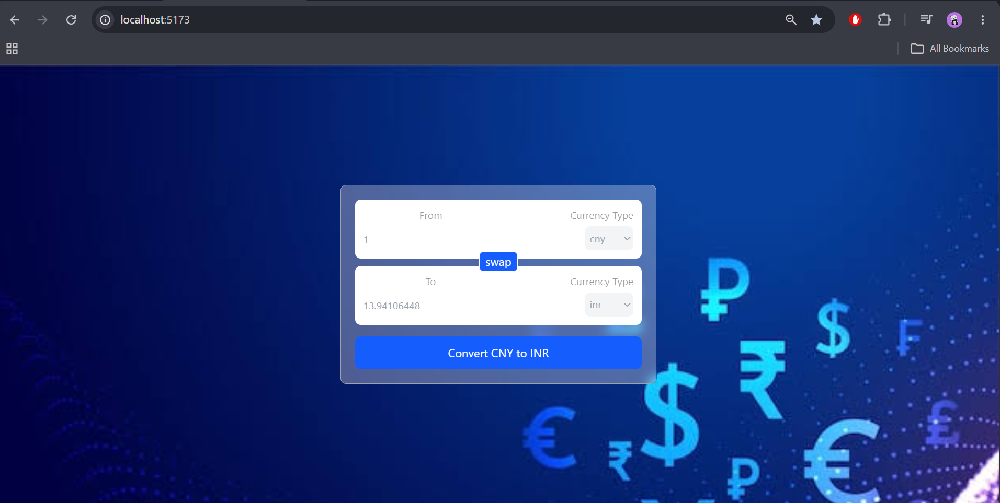

# Currency Converter 💱

A simple and responsive Currency Converter built using React.js.  
It converts one currency to another using real-time exchange rates.

## 🚀 Features

- Convert currency in real-time
- Swap currencies instantly
- Clean and responsive UI
- Dynamic currency selection
- API integration for live exchange rates

## 🛠 Tech Stack

- React.js
- JavaScript (ES6+)
- Tailwind CSS
- Vite
- Currency Exchange API

## 📸 Screenshot


## 📂 Project Structure

```bash
currencyconverter/
│── src/
│   ├── components/
│       ├── index.js
│       └── InputBox.jsx
│   ├── hooks/
│   │   └── useCurrencyInfo.js
│   ├── App.jsx
│   ├── index.css
│   ├── main.jsx
│── public/
│── package.json
```

## ⚙️ Installation

Clone the repository:

```bash
git clone https://github.com/kunalgautam827/currency-converter.git
```

Go to project folder:

```bash
cd currency-converter
```

Install dependencies:

```bash
npm install
```

Run project:

```bash
npm run dev
```

## 🔗 API Used

Currency API for real-time exchange rates.

Example:
```bash
https://latest.currency-api.pages.dev/v1/currencies/${currency}.json
```

## 💡 What I Learned

- React Hooks (`useState`, `useEffect`)
- Custom Hooks
- State Management
- API Fetching
- Reusable Components

## 🌟 Future Improvements

- Search currency option
- Dark mode
- Historical exchange charts
- Better animations

## 👨‍💻 Author

Kunal Gautam

---

If you liked this project, feel free to star this repository ⭐